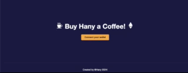
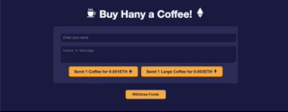
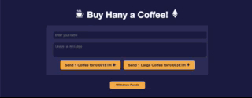
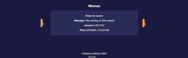

# BuyMeACoffee DApp

## Overview
The **BuyMeACoffee DApp** is a decentralized tipping application built on the Ethereum blockchain, enabling users to buy virtual coffee for others using Ether. The application provides a way for creators or content providers to receive support in the form of small donations, accompanied by personalized messages stored on-chain.

## Technologies Used
- **Solidity (Hardhat)**: For writing and deploying smart contracts.
- **Next.js**: For building the frontend application with server-side rendering and optimized performance.
- **Ethers.js**: For interacting with the Ethereum blockchain.
- **MetaMask**: For Ethereum wallet integration.
- **React Icons**: For adding iconography to the UI.
- **Toastify**: For notifications and alerts within the frontend.

## Features
- **Smart Contract**: Written in Solidity and deployed on the Sepolia test network. Supports buying a small coffee (0.001 ETH) and a large coffee (0.003 ETH) along with leaving a memo.
- **Responsive Frontend**: Created using Next.js with a modern and intuitive UI that interacts seamlessly with the smart contract.
- **On-Chain Data Storage**: Memos and transaction details are stored on-chain, allowing users to view past messages.
- **MetaMask Integration**: Allows users to connect their wallets, interact with the DApp, and make transactions.
- **Sepolia Network Integration**: Requires users to be connected to the Sepolia test network.

## Project Structure
The project is divided into two main parts:

1. **Backend**: Contains the smart contract logic developed using the Hardhat framework.
2. **Frontend**: A Next.js application that provides the user interface for interacting with the smart contract.

### Backend
The backend is responsible for the smart contract logic and deployment. It uses Hardhat to compile and deploy the contract, along with a series of tests to ensure contract functionality.

- 'contracts/BuyMeACoffee.sol': The main Solidity smart contract.
- 'scripts/deploy.js': Script used to deploy the contract.
- 'test/BuyMeACoffee.test.js': Test cases for validating the contract logic.

### Frontend
The frontend is built using Next.js and includes a series of UI components and styles to interact with the smart contract.

- 'pages/': Contains the main pages and routes used by the Next.js framework.
- 'styles/': Contains CSS files for styling.
- 'public/': Houses static assets like images and icons used within the project.

## Getting Started

### Prerequisites
- [Node.js](https://nodejs.org/) (v14+)
- [MetaMask Wallet](https://metamask.io/)
- Sepolia ETH for testing transactions

### Installation

1. Clone the repository:
    bash
    git clone https://github.com/your-username/BuyMeACoffee-DApp.git
    cd BuyMeACoffee-DApp

2. Install backend dependencies:
    bash
    cd backend
    npm install

3. Install frontend dependencies:
    bash
    cd ../frontend-react
    npm install

### Usage

1. Start the backend (Smart Contract deployment):
    bash
    cd backend
    npx hardhat node
    

2. Deploy the smart contract:
    bash
    npx hardhat run scripts/deploy.js --network localhost
    

3. Start the frontend:
    bash
    cd ../frontend-react
    npm run dev
    

4. Open your browser and navigate to:
    http://localhost:3000
    

## Project Demo

### Connect Wallet

### Buy Coffee

### withdraw-funds for the contract owner

### View Memo 

### Special Considerations
- **Network Switching**: The DApp is configured to work with the Sepolia test network. Users need to switch to Sepolia in MetaMask.
- **Gas Fees**: All transactions involve gas fees paid in Sepolia ETH.

## Future Improvements
- Add more coffee types and pricing options.
- Implement a message moderation system.
- Support for multiple cryptocurrencies using a third-party service like Chainlink.

## How to Run Tests
Navigate to the 'backend' folder and run the following command:
npx hardhat test
